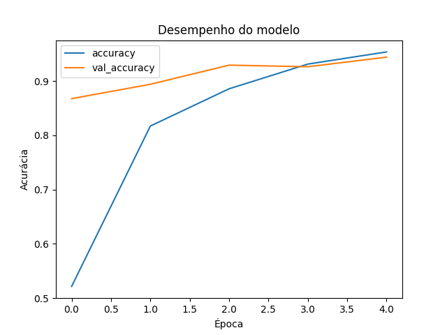
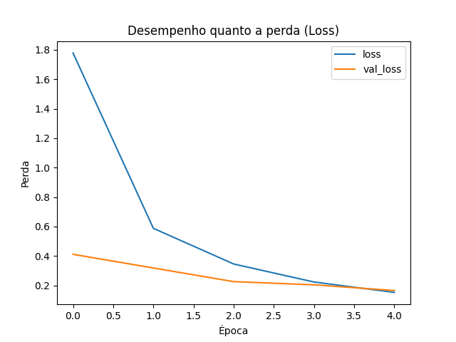
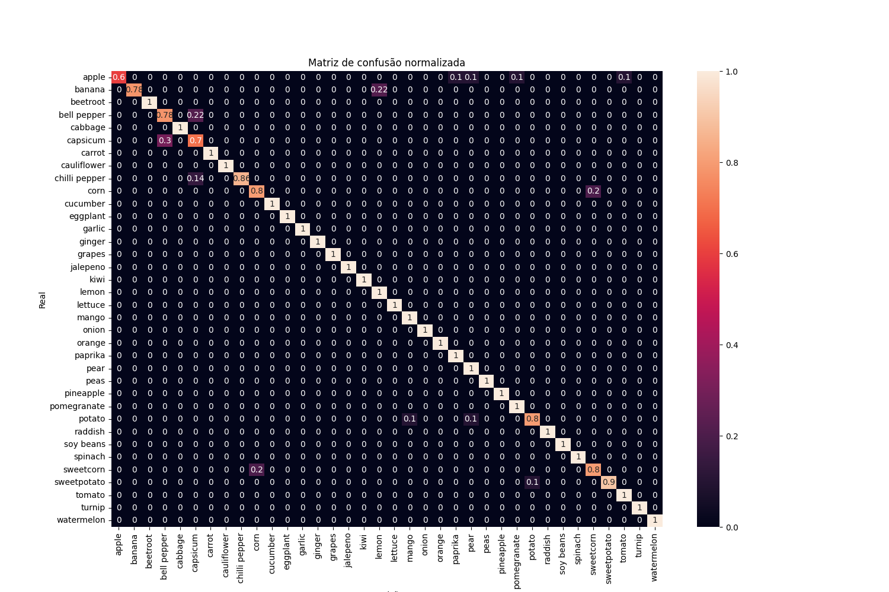
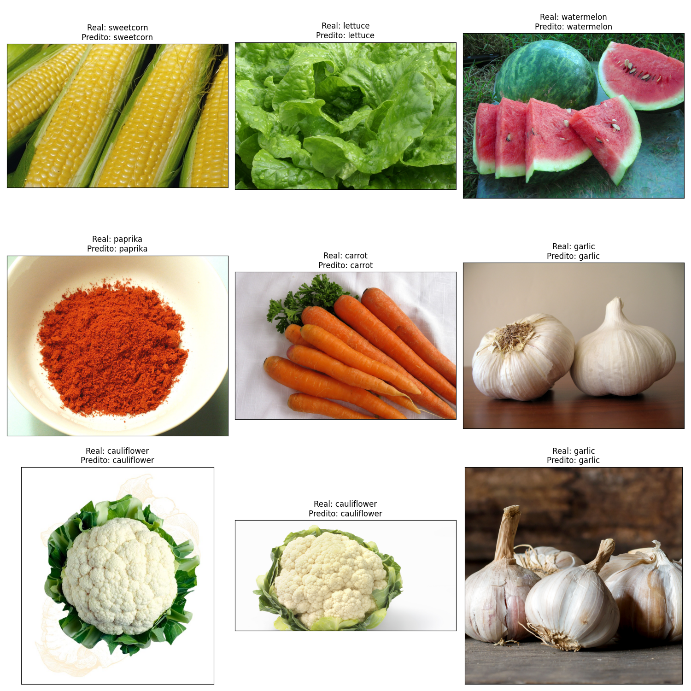

# Classificação de Frutas e Vegetais com CNN e Grad-CAM

Este projeto implementa uma pipeline completa para classificação de frutas e vegetais usando redes neurais convolucionais (CNNs) com a arquitetura pré-treinada **MobileNetV2**. Além disso, o projeto utiliza a técnica **Grad-CAM** para gerar mapas de ativação e visualizar as regiões da imagem que influenciam as previsões do modelo.

Dados tirado do Kaggle: [Fruits and Vegetables Image Recognition Dataset](https://www.kaggle.com/datasets/kritikseth/fruit-and-vegetable-image-recognition)


---

## Sumário

- [Classificação de Frutas e Vegetais com CNN e Grad-CAM](#classificação-de-frutas-e-vegetais-com-cnn-e-grad-cam)
  - [Sumário](#sumário)
  - [Contexto](#contexto)
  - [Estrutura do Projeto](#estrutura-do-projeto)
  - [Pré-processamento e Preparação dos Dados](#pré-processamento-e-preparação-dos-dados)
  - [Geradores de Imagens e Data Augmentation](#geradores-de-imagens-e-data-augmentation)
  - [Arquitetura do Modelo e Treinamento](#arquitetura-do-modelo-e-treinamento)
  - [Avaliação e Visualização dos Resultados](#avaliação-e-visualização-dos-resultados)
  - [Visualização com Grad-CAM](#visualização-com-grad-cam)
  - [Resultados](#resultados)
    - [Desempenho do Modelo](#desempenho-do-modelo)
    - [Matriz de Confusão](#matriz-de-confusão)
    - [Previsões do Modelo](#previsões-do-modelo)
  - [Como Executar o Projeto](#como-executar-o-projeto)
  - [Referências](#referências)

---

## Contexto

O dataset contém **3861 imagens** de **36** classes de frutas e vegetais. As classes estão divididas em duas categorias principais:
- **Frutas:** banana, apple, pear, grapes, orange, kiwi, watermelon, pomegranate, pineapple, mango.
- **Vegetais:** cucumber, carrot, capsicum, onion, potato, lemon, tomato, raddish, beetroot, cabbage, lettuce, spinach, soy bean, cauliflower, bell pepper, chilli pepper, turnip, corn, sweetcorn, sweet potato, paprika, jalepeno, ginger, garlic, peas, eggplant.

Cada classe possui um número fixo de imagens para treinamento, teste e validação, organizadas em pastas específicas.

---

## Estrutura do Projeto

O repositório possui a seguinte organização:

```
├── data/
│   ├── train/           # Imagens de treinamento (subpastas por classe)
│   ├── validation/      # Imagens de validação (subpastas por classe)
│   └── test/            # Imagens de teste (subpastas por classe)
├── notebooks/           # Notebooks para experimentos e visualizações
├── src/                 # Scripts de código fonte (pré-processamento, treinamento, etc.)
└── README.md            # Este arquivo
```

---

## Pré-processamento e Preparação dos Dados

1. **Carregamento dos Caminhos dos Arquivos:**  
     Utiliza a biblioteca `pathlib` para navegar nas pastas e coletar os caminhos das imagens.
     ```python
     from pathlib import Path

     train_dir = Path('./data/train')
     train_filepaths = list(train_dir.glob(r'**/*.jpg'))

     test_dir = Path('./data/test')
     test_filepaths = list(test_dir.glob(r'**/*.jpg'))

     val_dir = Path('./data/validation')
     val_filepaths = list(val_dir.glob(r'**/*.jpg'))
     ```

2. **Criação do DataFrame:**  
     A função `proc_img(filepath)` cria um DataFrame com duas colunas: `Filepath` (caminho da imagem) e `Label` (rótulo extraído do nome da pasta onde a imagem está).
     ```python
     def proc_img(filepaths):
             """ Cria um DataFrame com os caminhos dos arquivos e seus respectivos rótulos """
             labels = [str(filepaths[i]).split("/")[-2] for i in range(len(filepaths))]
             filepath_series = pd.Series(filepaths, name='Filepath').astype(str)
             label_series = pd.Series(labels, name='Label')
             df = pd.concat([filepath_series, label_series], axis=1)
             df = df.sample(frac=1).reset_index(drop=True)
             return df

     train_df = proc_img(train_filepaths)
     test_df = proc_img(test_filepaths)
     val_df = proc_img(val_filepaths)
     ```

3. **Visualização Inicial:**  
     É gerado um grid de imagens únicas para cada classe, facilitando a verificação dos rótulos e da qualidade dos dados.

---

## Geradores de Imagens e Data Augmentation

Para carregar as imagens em memória e aplicar transformações (aumento de dados), utiliza-se o `ImageDataGenerator` do Keras. Veja os principais parâmetros utilizados:

```python
train_images = train_generator.flow_from_dataframe(
        dataframe=train_df,
        x_col='Filepath',            # Coluna com os caminhos dos arquivos
        y_col='Label',               # Coluna com os rótulos
        target_size=(224, 224),      # Redimensionamento para 224x224 pixels (compatível com MobileNetV2)
        color_mode='rgb',            # Imagens coloridas
        class_mode='categorical',    # Rótulos codificados como categorias (one-hot encoding)
        batch_size=32,               # Número de imagens por lote
        shuffle=True,                # Embaralha as imagens a cada época
        seed=0,                      # Semente para reprodutibilidade
        rotation_range=30,           # Rotaciona as imagens em até 30 graus
        zoom_range=0.15,             # Aplica zoom aleatório
        width_shift_range=0.2,       # Deslocamento horizontal
        height_shift_range=0.2,      # Deslocamento vertical
        shear_range=0.15,            # Cisalhamento
        horizontal_flip=True,        # Inverte horizontalmente as imagens
        fill_mode="nearest"          # Preenche pixels vazios com os vizinhos mais próximos
)
```

Esses parâmetros aumentam a diversidade das imagens, ajudando o modelo a generalizar melhor e evitando overfitting.

---

## Arquitetura do Modelo e Treinamento

1. **Modelo Pré-treinado:**  
     Utiliza o **MobileNetV2** com pesos do ImageNet, sem incluir a camada de classificação final (`include_top=False`) e com pooling global médio (`pooling='avg'`).
     ```python
     pretrained_model = tf.keras.applications.MobileNetV2(
             input_shape=(224, 224, 3),
             include_top=False,
             weights='imagenet',
             pooling='avg'
     )
     pretrained_model.trainable = False
     ```

2. **Camadas Personalizadas:**  
     São adicionadas camadas densas (fully connected) para adaptar o modelo às 36 classes do dataset:
     ```python
     inputs = pretrained_model.input
     x = tf.keras.layers.Dense(128, activation='relu')(pretrained_model.output)
     x = tf.keras.layers.Dense(128, activation='relu')(x)
     outputs = tf.keras.layers.Dense(36, activation='softmax')(x)
     model = tf.keras.Model(inputs=inputs, outputs=outputs)
     ```

3. **Compilação e Treinamento:**  
     O modelo é compilado com o otimizador Adam e função de perda `categorical_crossentropy`. Durante o treinamento, utiliza-se `EarlyStopping` para interromper caso o desempenho na validação não melhore.
     ```python
     model.compile(
             optimizer='adam',
             loss='categorical_crossentropy',
             metrics=['accuracy']
     )

     history = model.fit(
             train_images,
             validation_data=val_images,
             epochs=5,
             callbacks=[
                     tf.keras.callbacks.EarlyStopping(
                             monitor='val_loss',
                             patience=2,
                             restore_best_weights=True
                     )
             ]
     )
     ```

4. **Visualização do Treinamento:**  
     São plotados gráficos de acurácia e perda ao longo das épocas para monitorar o desempenho do modelo.

---

## Avaliação e Visualização dos Resultados

1. **Previsões e Acurácia:**  
     O modelo é testado utilizando o conjunto de teste e a acurácia é calculada.
     ```python
     pred = model.predict(test_images)
     pred = np.argmax(pred, axis=1)
     ```
     Os rótulos são convertidos de índices para nomes das classes e a acurácia é impressa.

2. **Matriz de Confusão:**  
     Uma matriz de confusão normalizada é gerada para visualizar o desempenho por classe.
     ```python
     from sklearn.metrics import confusion_matrix
     import seaborn as sns
     cf_matrix = confusion_matrix(y_test, pred, normalize='true')
     sns.heatmap(cf_matrix, annot=True, xticklabels=sorted(set(y_test)), yticklabels=sorted(set(y_test)))
     ```

3. **Visualização de Imagens com Previsões:**  
     São exibidas algumas imagens de teste com os rótulos verdadeiros e as previsões do modelo, facilitando a interpretação dos resultados.

---

## Visualização com Grad-CAM

A técnica **Grad-CAM** (Gradient-weighted Class Activation Mapping) é utilizada para entender quais regiões da imagem foram mais relevantes para a decisão do modelo. O processo envolve:

1. **Preparação da Imagem:**  
     A função `get_img_array()` carrega e redimensiona a imagem.

2. **Cálculo do Mapa de Ativação:**  
     A função `make_gradcam_heatmap()` cria um novo modelo que retorna as ativações da última camada convolucional e as previsões. Em seguida, calcula os gradientes e gera o heatmap que indica as áreas mais influentes.

3. **Exibição do Resultado:**  
     A função `save_and_display_gradcam()` sobrepõe o heatmap (colorido com o colormap "jet") na imagem original para visualizar as regiões de maior ativação.

```python
def make_gradcam_heatmap(img_array, model, last_conv_layer_name, pred_index=None):
        grad_model = tf.keras.models.Model(
                [model.inputs],
                [model.get_layer(last_conv_layer_name).output, model.output]
        )
        with tf.GradientTape() as tape:
                last_conv_layer_output, preds = grad_model(img_array)
                if pred_index is None:
                        pred_index = tf.argmax(preds[0])
                class_channel = preds[:, pred_index]
        grads = tape.gradient(class_channel, last_conv_layer_output)
        pooled_grads = tf.reduce_mean(grads, axis=(0, 1, 2))
        last_conv_layer_output = last_conv_layer_output[0]
        heatmap = last_conv_layer_output @ pooled_grads[..., tf.newaxis]
        heatmap = tf.squeeze(heatmap)
        heatmap = tf.maximum(heatmap, 0) / tf.math.reduce_max(heatmap)
        return heatmap.numpy()
```

---

## Resultados

### Desempenho do Modelo

- **Acurácia de Treinamento e Validação:**
    

- **Perda de Treinamento e Validação:**
    

### Matriz de Confusão

- **Matriz de Confusão Normalizada:**
    

### Previsões do Modelo

- **Imagens de Teste com Previsões:**
    

---

## Como Executar o Projeto

1. **Requisitos:**  
     - Python 3.11 
     - TensorFlow 2.x  
     - Pandas, NumPy, Matplotlib, Seaborn, scikit-learn

2. **Instalação das Dependências:**
     ```bash
     pip install tensorflow pandas numpy matplotlib seaborn scikit-learn
     ```

3. **Estrutura de Pastas:**  
     Certifique-se de que a estrutura do dataset esteja conforme descrito (pastas `train`, `validation` e `test` com subpastas para cada classe).

4. **Executar o Script/Notebook:**  
     - Execute o notebook ou script principal localizado na pasta `notebooks/` ou `src/`.
     - Acompanhe a saída no console e as visualizações geradas (gráficos, matrizes de confusão, imagens com Grad-CAM).

---

## Referências

- [TensorFlow MobileNetV2](https://www.tensorflow.org/api_docs/python/tf/keras/applications/MobileNetV2)
- [Keras ImageDataGenerator](https://www.tensorflow.org/api_docs/python/tf/keras/preprocessing/image/ImageDataGenerator)
- [Grad-CAM: Visual Explanations from Deep Networks via Gradient-based Localization](https://arxiv.org/abs/1610.02391)

---

Este relatório detalha o fluxo de trabalho do projeto, explicando desde o pré-processamento dos dados até a avaliação do modelo e a visualização com Grad-CAM. A ideia é facilitar o entendimento para novos colaboradores ou para quem deseja reproduzir e estender o projeto.

---

Qualquer dúvida ou sugestão, sinta-se à vontade para abrir uma issue ou enviar um pull request!